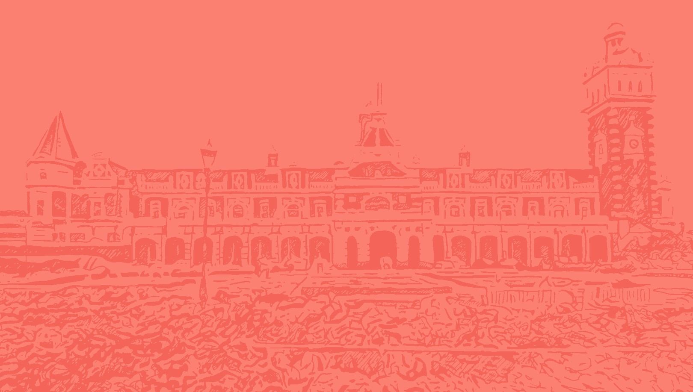
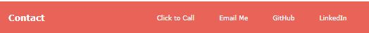

# Portfolio
My Portfolio

Technologies Used: HTML, CSS, JavaScript

Live Link:

## Requirements

* Submit an updated portfolio featuring Project 1 and two exemplary homework assignments.

* Submit an updated GitHub profile with pinned repositories featuring Project 1 and two exemplary assignments.

* Submit an updated resume

* Submit an updated LinkedIn profile

# Online Portfolio

We have just finished our first group project and asked to redesign our earlier homework assignment (Week 2 Portfolio). That homework assignment I had made the portfolio for Michael Collins, retried astronaut turned coder. Now it is my turn. I wanted to show in my portfolio what I have learnt since then and also personalise it more to me.

## Representing me
I have a background in fine arts and I wanted to bring this into my portfolio. So instead of a plain background colour, I chose to go with one of my own works. For the shop I currently work at, I sell city scapes that I drew in ink. I decided to choose one that I drew of the Dunedin Railway Station, a subtle nod to my hometown. Originally this is a black and white drawing, but with photoshop, I was able to change this. I wanted this to be subtle and soft as I was going to put writing over top. I decided to go with shades of pink. One pink and one a few shades lighter. I thought there was enough of a contrast to notice the difference, but not too much that it would distract from the writing.

## Navbar
From here I knew that I wanted my writing colour to be wite. I believe this is a better choice than black as it would of been too harsh on the pink. White works as the pinks chosen as still dark enough to be able to read easily.

I decided that instead of my name, I would create a logo. I went with something easy, but I think at the end of this course, I would like to create one from scratch. For now, just a K with a white border. Keeping it clean and simple. 
For my nav links, I had them on the opposite end and decided to add the same border as the logo. To bring my website some repetition. I decided to put a transparent border around the words and when you hover, that is when it changes to white. 

## Typewriter

Here is where I wanted to show my JavaScript skills off. I originally look at the css tricks website to see how it would look on my site. Once I decided that yes, that was what I wanted. I deleted the code and tried making it for myself. This way I was able to apply what I learnt during my classes and assignments. It did take me a lot longer than I wanted it too but it felt amazing that I was able to accomplish this from scratch and really happy with how it looks. 

I did originally have a link blinking at the end of the word, but I decided to change this to a blinking line at the bottom. So it would represent the terminal. Getting that right was a lot of fun to do.

## Featured Project

As required, we needed to include our first project we did. In Michael Collin's portfolio, they had the layout different. They had a large image with a small text box saying the project's name. You would click it and it would take you to the link.

I wanted to be different. I decided to add in a description of the project, technologies used. Along with to icons, one for a link to github and other a link to the actual website. 

I also left white space around the text block. One, to make the page less crowded. Give it more of a simple and clean vibe. Also, if I were to have more projects, or want to write more, then I have the template and room to do so.

## Small Projects

For the two chosen assignments, I decided to go with a card layout similar to week 2's portfolio. But instead of the cards over the image, to have below and in keeping with the layout of the featured project.

I also then added to my icons. I decided to add borders for these too. So when you hover, it will have a pink border.

## Footer

Footer! Same layout as the previous portfolio, nice and simple.
I added links for my phone number, email, linkedIn and gitHub. 

Overall, really happy with my layout out. I completed what I wanted and feels very true to me. I also have a few ideas on what I want to do to improve this which I feel like I will keep adding to over this course.

# Results - Mobile View

## Resume
You can find my resume as a pdf in this folder (on GitHub) or on my website.

## GitHub

## LinkedIn

### If you have any questions or want more information, please feel free to reach out to me via email.